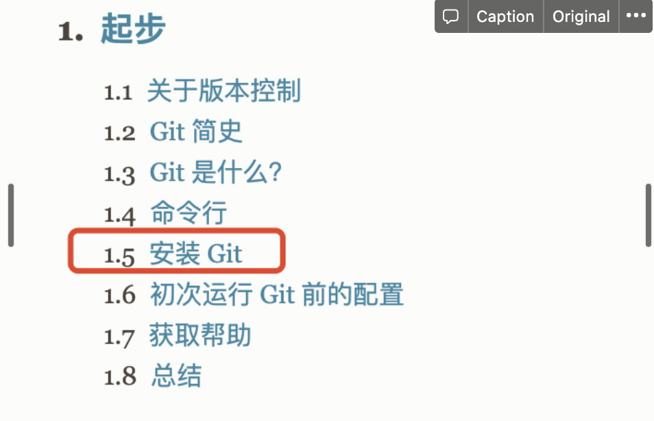
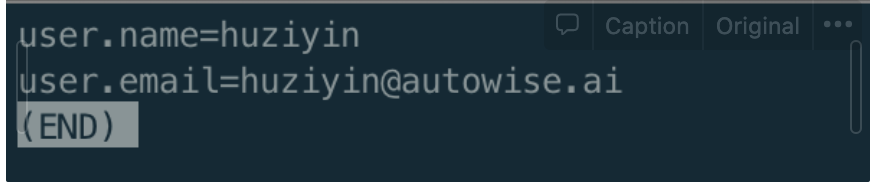

git的安装

可到[git官网](https://git-scm.com/book/zh/v2) 按照提示，下载安装。



### 配置

便于以后分支变更发可以发到个人邮箱。（工作邮箱）

```
$ git config --global user.name "huziyin"
$ git config --global user.email "huziyin@autowise.ai"
```

```
$ git config --list --global 
$ git config --list --local // local优先级大于global
```



```
--global 对当前所有仓库有效
--local 只对某个仓库有效
--system 对系统所有登录的用户有效
```


